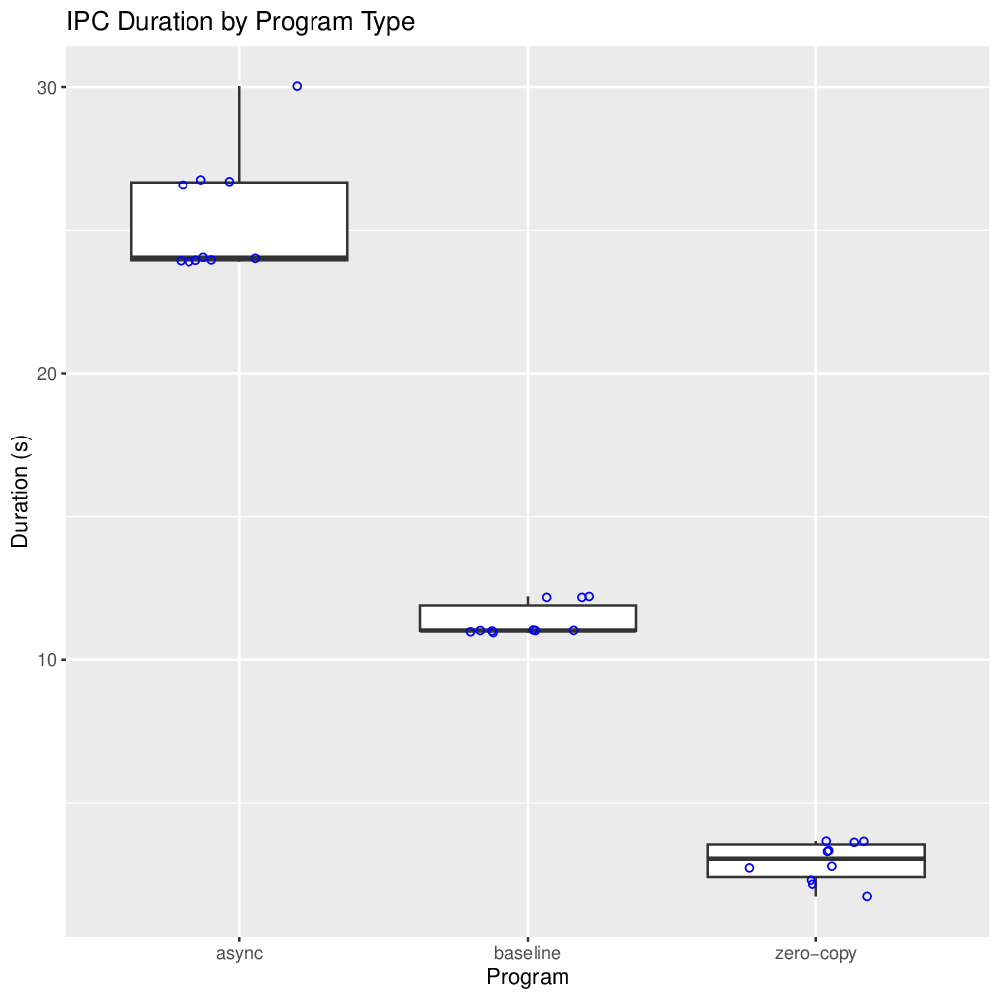
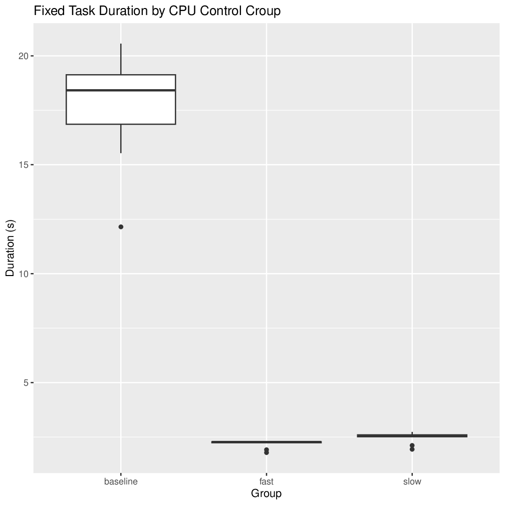
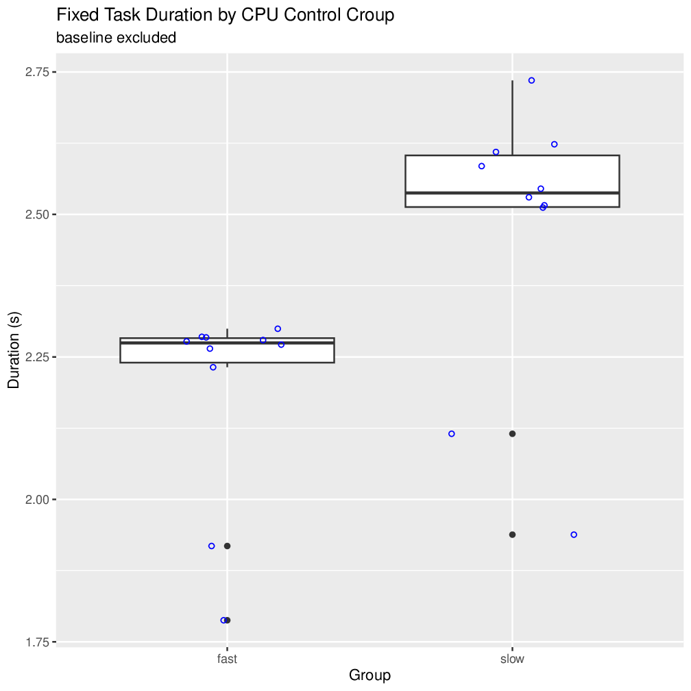

# Project 1
## General Info
Computer/CPU info can be found in the README at the root of this repository

## Usage
The default `make` target will create a build of each source file. `make clean`
can be run to delete all intermediate and output files generated by `make`.

The `generate____Csv.sh` scripts will run the various programs ten times and
output the results to a CSV file. From there, `generateCharts.R` will read in
all the CSV data, print any required tables, and create a pdf called
`Rplots.pdf` containing any graphs.

To turn the PDF into a series of images I could embed in this markdown file, I
ran:
```
cpdf Rplots.pdf -gs gs -output-image -o images/chart%%.png
```
Of course, the ability to run some of these commands on your machine depends on
having the proper packages installed on your system, namely the 'R' language
(and some R libraries) and 'cpdf'/'gs' for pdf->png conversion.

## Features
For this, we were required to chose four features to experiment with. I have
chosen the following features:
1) Zero-copy I/O
2) Async I/O
3) Scheduler control groups
4) Transparent huge pages

## Tests 1 and 2: Zero-copy I/O and Async I/O
To test the effects of both zero-copy I/O and async I/O, I have decided to use
IPC between a parent and child process as my I/O. For a baseline, I setup a
simple named pipe and sent 10,000,000 integers down the pipe from the parent to
the child. Once I'd verified that all the numbers were coming through
consistently and there was no "packet loss," I added basic timing functionality.
Timing is started right before the parent process gets ready to send the first
number, and is stopped when the child process receives the final packet.

For the zero-copy I/O, a similar setup was used, but the named pipe was replaced
with a region of shared memory and a circular buffer. As the processes directly
shared the memory, there was no copying my the kernel in the IPC, and both
processes could read/write from the same buffer. Once again it was timed from
before the first number was sent, and after the last had been received.

For the async I/O, I went back to named pipes, but instead opened them in a
non-blocking fashion. As this program wasn't doing anything else, it couldn't
exactly make good use of the time saved by being non-blocking, and ultimately
just sat around waiting for each number to send anyways.

Each of these programs was run 10 times, and the average durations of each IPC
method across the 10 tests are listed in the graph and table below.

### Graph 1


### Table 1
|                   |   Baseline   |  Zero-copy  |    Async    |
|:-----------------:|:------------:|:-----------:|:-----------:|
| Mean Duration (s) |     11.4     |    2.91     |    25.4     |
|  Mean CPU Cycles  | 29647958444  | 7608492365  | 66317315250 |

As I had expected, the zero-copy I/O where the two processes directly share
memory performs significantly better than the baseline. The thing of note here,
however, is the fact that the async I/O took more than twice as long as the
baseline.

The way the blocking (baseline) reads/writes work is by simply waiting until the
FIFO is ready to receive a new letter or has one ready to be read. Once ready,
it reads or writes the data, and returns. By contrast, in the non-blocking mode,
we have to poll the FIFO manually to see if it's ready, and then only issue the
read/write command then. This almost certainly has more overhead than whatever
the kernel's doing internally on the blocking mode, and is my best reasoning for
why the async communication is so slow.

Of course, async I/O does have many uses. If this program did something other
than streaming data, it could take the time saved by not waiting on the blocking
reads/writes to perform other tasks, and only poll the FIFO when it's
convenient. Sure, the transmission may be slower, but it may make the overall
application faster, and the overhead has significantly less impact.

## Test 3: Scheduler control groups
To test the effect of scheduler control groups (cgroups), I started by firing up
100 useless processes to eat all of our CPU time and keeping it running at 100%,
such that the scheduler would be guaranteed to be in-action and scheduling to
the best of its abilities.

With these background processes running, I had the CPU do a fixed amount of work
and timed it as a baseline test. I then joined a cgroup with its scheduler
weight set to low priority (most processes have a weight of 100, this one I gave
a weight of 10; higher gets more CPU time) and timed the work again. Finally, I
joined a high priority cgroup (weight of 1000; max priority) and timed the work
again.

As with how I ran the IPC tests, I again ran 10 of each trial and averaged them
out, as seen here.

### Graph 2


### Graph 3
Because the baseline took so much longer than either control group, here's the
same chart with the baseline excluded so you can tell the difference in the slow
and fast groups.


### Table 2
|                   |   Baseline   | Slow cgroup | Fast cgroup |
|:-----------------:|:------------:|:-----------:|:-----------:|
| Mean Duration (s) |     17.7     |    2.47     |    2.19     |
|  Mean CPU Cycles  | 46254527263  | 6452014810  | 5718321537  |

Even adding the process to a slower cgroup makes it run significantly faster
than the baseline which resides in the default system "root" cgroup along with
my system processes and all 100 useless CPU-wasting processes. From what I can
gleam from Google, it seems Linux doesn't give priority to individual
applications based on their weight, but prioritizes the groups themselves and
then divides the group's time among the processes in the group.

So even if the "root" cgroup (with baseline, 100 CPU-wasters, and system
processes) is given 50% of the CPU time, that's divided by over 100, and the
baseline test gets less than 0.5% of the total time. And let's say the "slow"
group is given only 10% of the CPU (as opposed to the root's 50%), as our test
is the only thing in that group, it's still given more total CPU time than the
baseline because it has the whole group to itself.

And of course the high priority "fast" group is faster than either, as it both
has its own group and its group has the maximum possible priority.
