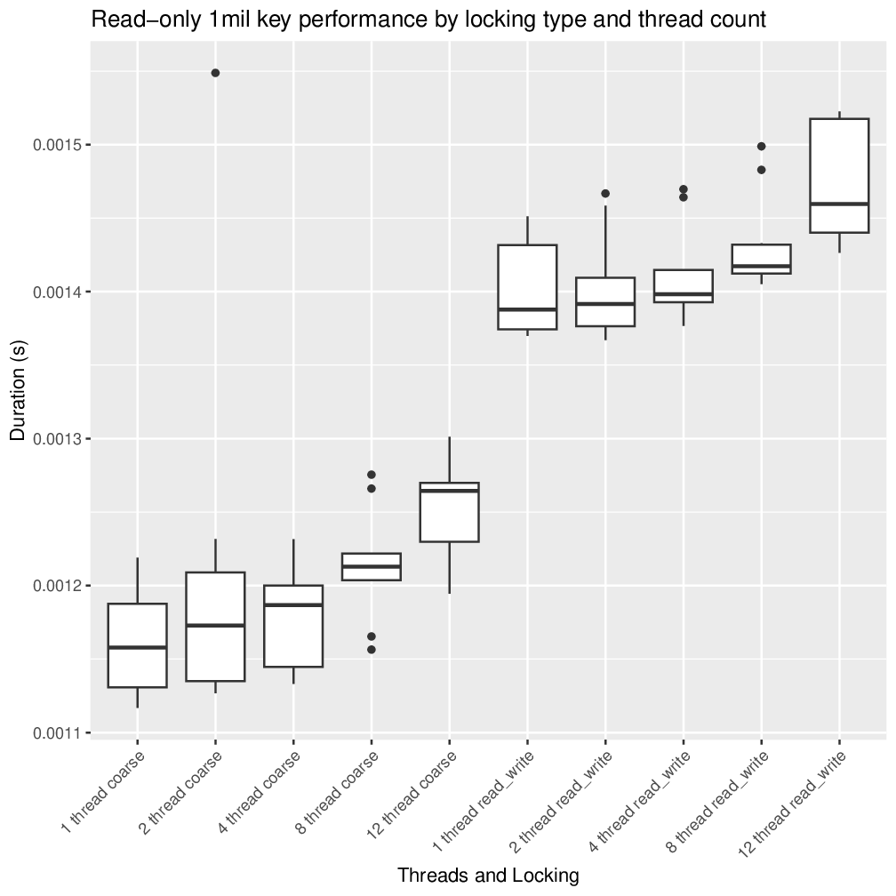
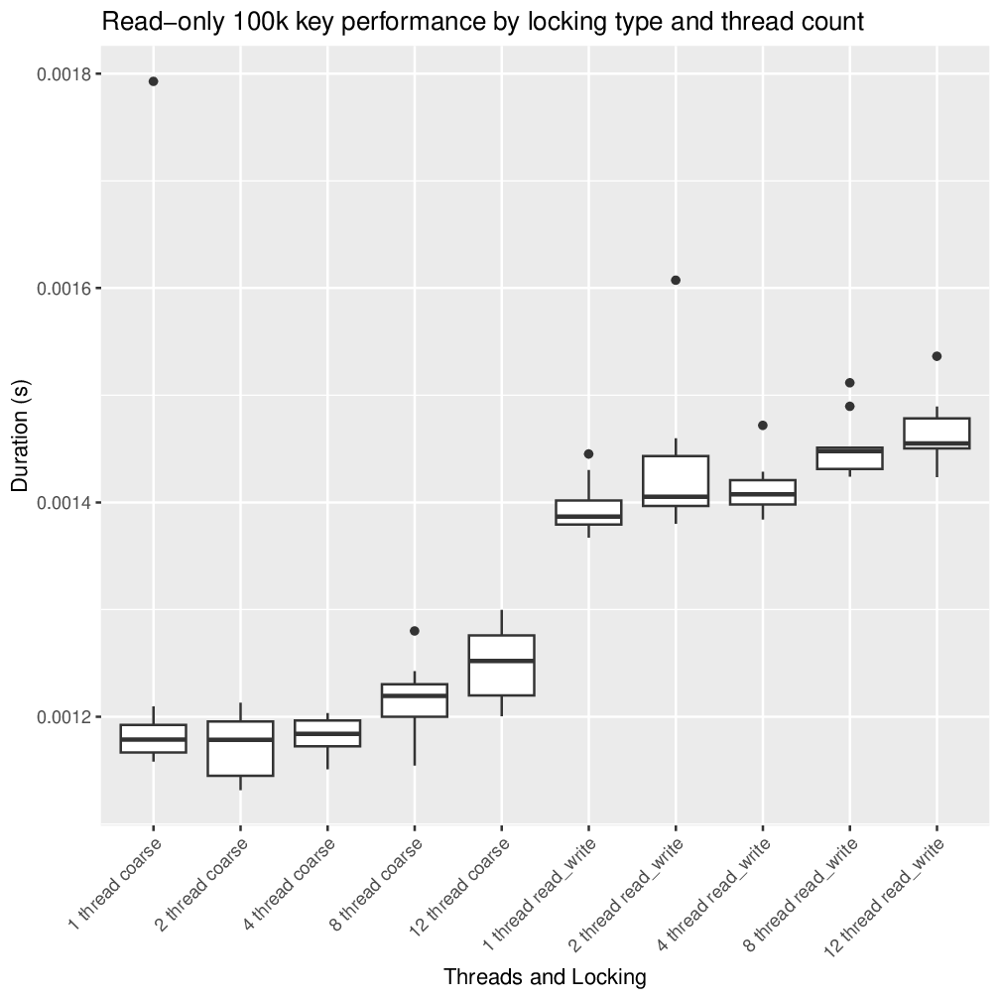
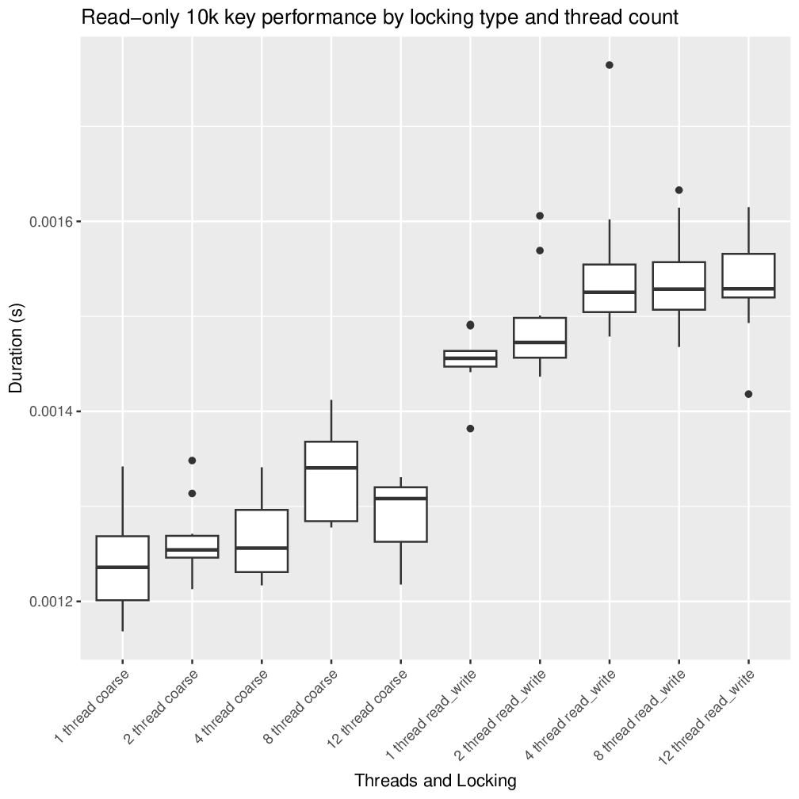
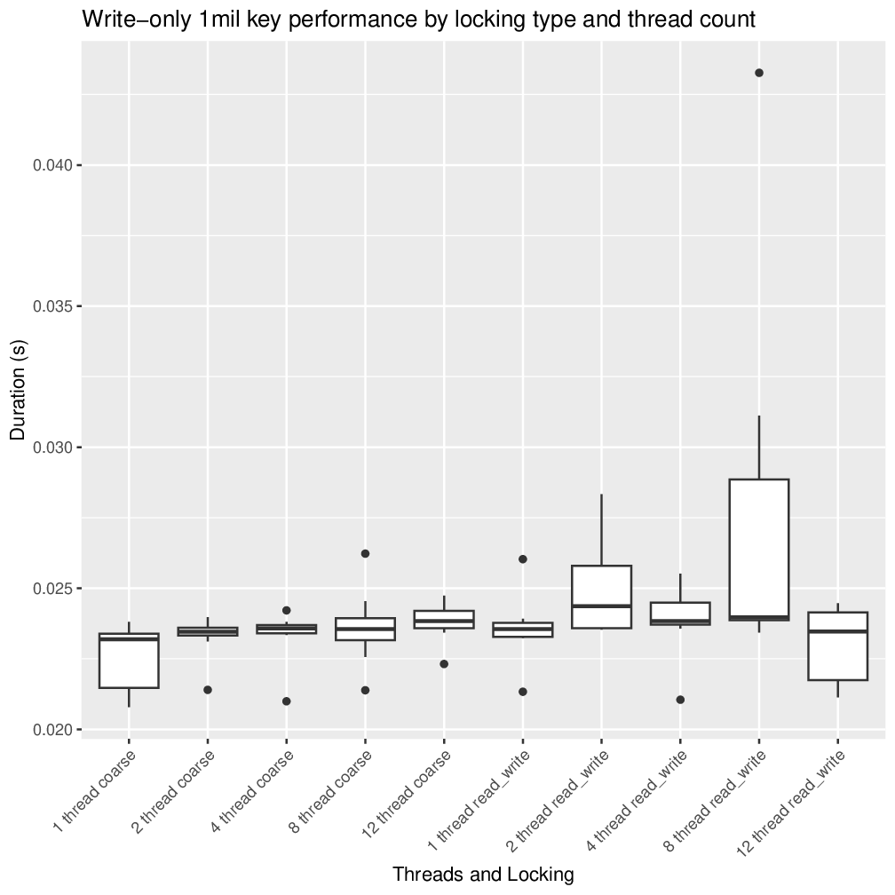
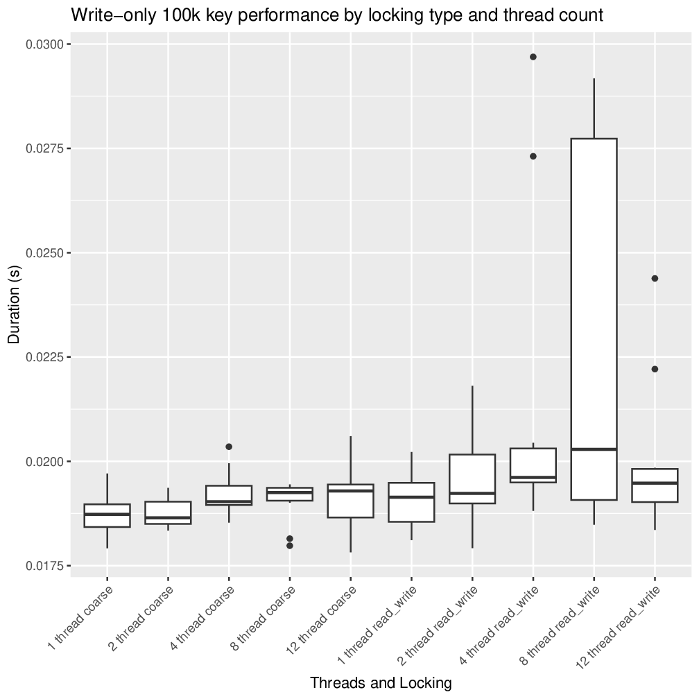
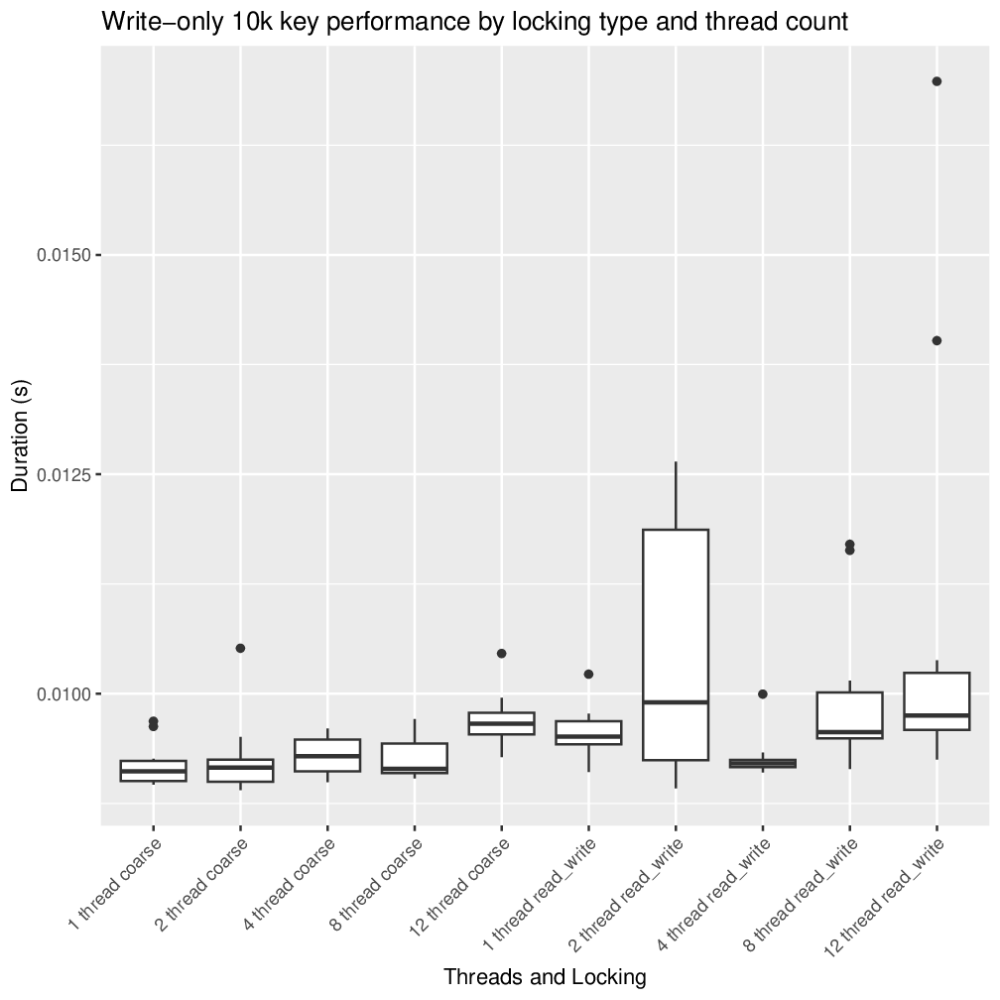
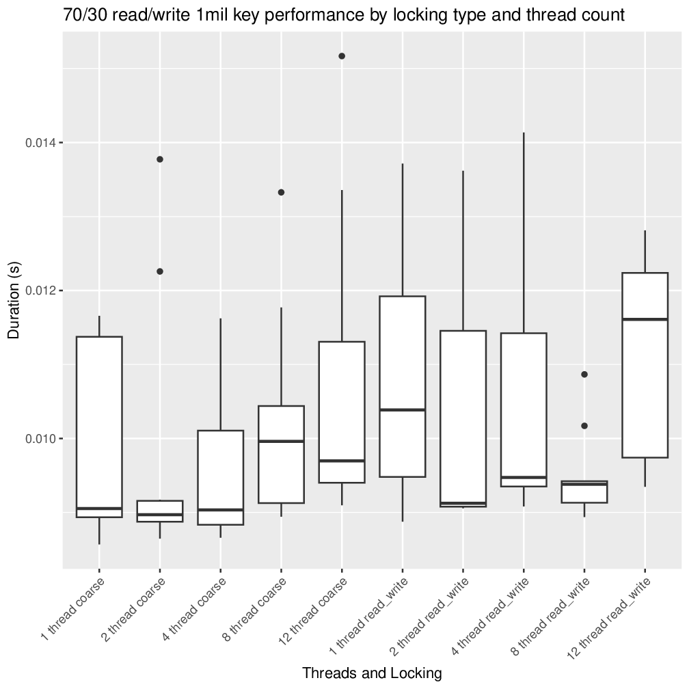
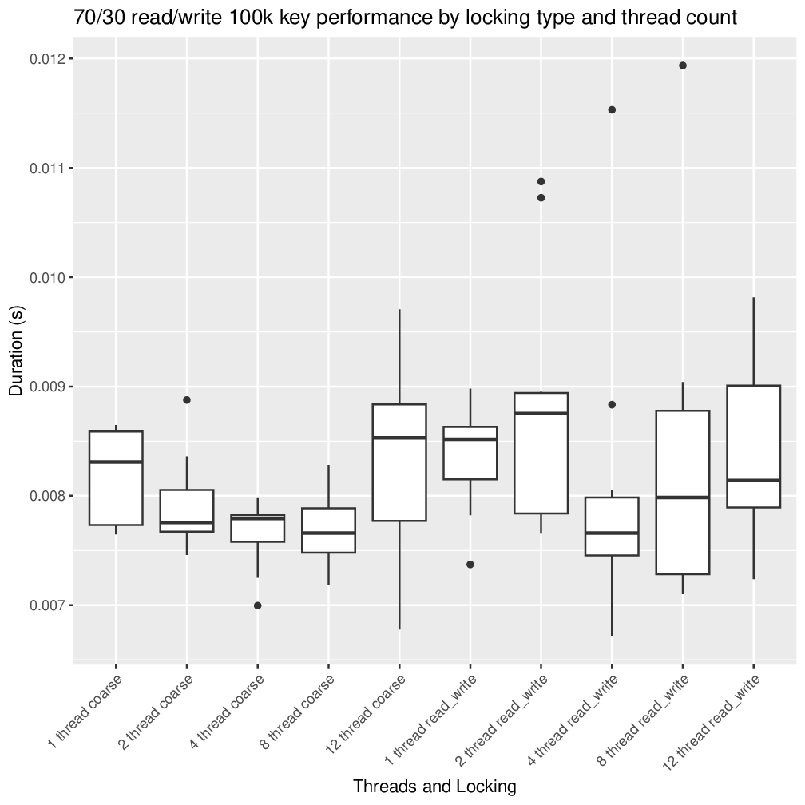
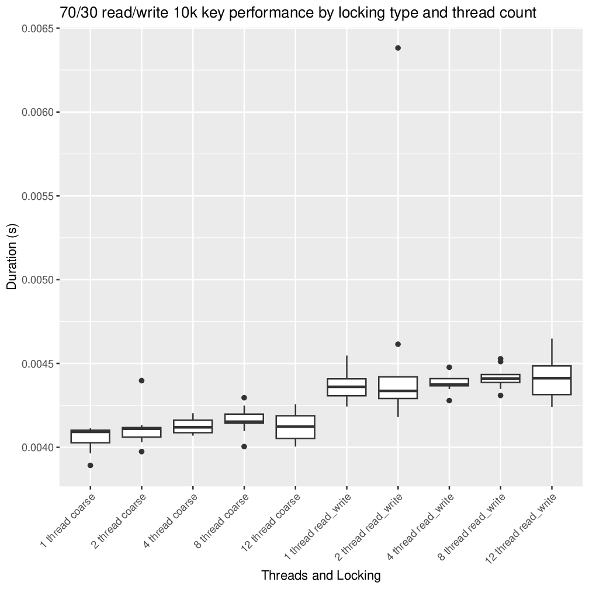

# Project 1
## General Info
Computer/CPU info can be found in the README at the root of this repository

## Usage
The default `make` target will create a build of each source file. `make clean`
can be run to delete all intermediate and output files generated by `make`.

The `generateCsv.sh` script will run the various programs under each
configuration ten times and output the results to a CSV file. From there,
`generateCharts.R` will read in all the CSV data, print any required tables, and
create a pdf called `Rplots.pdf` containing any graphs.

To turn the PDF into a series of images I could embed in this markdown file, I
ran:
```
cpdf Rplots.pdf -gs gs -output-image -o images/chart%%.png
```
Of course, the ability to run some of these commands on your machine depends on
having the proper packages installed on your system, namely the 'R' language
(and some R libraries) and 'cpdf'/'gs' for pdf->png conversion.

## Choices & Process
For this, we had to choose between a hash table, binary search tree (BST), or a
simplified B+ tree. I went with a BST. In addition, I chose to do reader/writer
locks for my "additional strategy." All locks were implemented with C++ mutexes.
The coarse-grain locking had a single `std::mutex` object that protected the
entire tree and allowed only one thread to access it at a time. The
reader/writer locking instead used a `std::shared_mutex` such that as many
threads as needed could read simultaneously, but when a thread wanted to write,
it was given exclusive access to the tree.

I will also note, there is absolutely zero balancing of this BST. It is almost
assuredly horribly skewed in some form or another each test.

For each test, 100,000 operations were performed on the tree, split among
however many threads were running in the given test.

Tests were run with all combinations of the following parameters:

* Coarse vs reader/writer locking
* Read-only vs write-only vs 70/30 read/write
* 10,000 keys vs 100,000 keys vs 1,000,000 keys
* 1, 2, 4, 8, and 12 threads (my CPU has 12 threads)

That means there's 90 different test categories, and each was run 10 times.

## Results Data
There is a TON of raw data from this project. Here's a table with the results of
all 90 tests (only the means of each 10-trial batch is shown so this data isn't
*too overwhelming*). Charts are provided afterwards, which makes it more
reasonable to comprehend the data. Actual data analysis is located at the end of
the report.

### Table 1
|  locking   |    job     | threads | keys  | mean_duration | mean_cycles |
|:----------:|:----------:|:-------:|:-----:|:-------------:|:-----------:|
|   coarse   | read_only  |    1    | 1e+04 |   0.0012407   |   3239181   |
|   coarse   | read_only  |    1    | 1e+05 |   0.0012400   |   3237672   |
|   coarse   | read_only  |    1    | 1e+06 |   0.0011623   |   3034828   |
|   coarse   | read_only  |    2    | 1e+04 |   0.0012641   |   3300180   |
|   coarse   | read_only  |    2    | 1e+05 |   0.0011742   |   3065948   |
|   coarse   | read_only  |    2    | 1e+06 |   0.0012055   |   3147653   |
|   coarse   | read_only  |    4    | 1e+04 |   0.0012658   |   3304676   |
|   coarse   | read_only  |    4    | 1e+05 |   0.0011829   |   3088517   |
|   coarse   | read_only  |    4    | 1e+06 |   0.0011771   |   3073371   |
|   coarse   | read_only  |    8    | 1e+04 |   0.0013334   |   3481269   |
|   coarse   | read_only  |    8    | 1e+05 |   0.0012164   |   3175976   |
|   coarse   | read_only  |    8    | 1e+06 |   0.0012141   |   3169878   |
|   coarse   | read_only  |   12    | 1e+04 |   0.0012909   |   3370329   |
|   coarse   | read_only  |   12    | 1e+05 |   0.0012491   |   3261511   |
|   coarse   | read_only  |   12    | 1e+06 |   0.0012547   |   3276078   |
|   coarse   | read_write |    1    | 1e+04 |   0.0040556   |  10589364   |
|   coarse   | read_write |    1    | 1e+05 |   0.0081797   |  21357907   |
|   coarse   | read_write |    1    | 1e+06 |   0.0099207   |  25903548   |
|   coarse   | read_write |    2    | 1e+04 |   0.0041139   |  10741724   |
|   coarse   | read_write |    2    | 1e+05 |   0.0079078   |  20647734   |
|   coarse   | read_write |    2    | 1e+06 |   0.0097452   |  25445218   |
|   coarse   | read_write |    4    | 1e+04 |   0.0041288   |  10780654   |
|   coarse   | read_write |    4    | 1e+05 |   0.0076599   |  20000455   |
|   coarse   | read_write |    4    | 1e+06 |   0.0095033   |  24813604   |
|   coarse   | read_write |    8    | 1e+04 |   0.0041617   |  10866581   |
|   coarse   | read_write |    8    | 1e+05 |   0.0076846   |  20064545   |
|   coarse   | read_write |    8    | 1e+06 |   0.0102277   |  26704974   |
|   coarse   | read_write |   12    | 1e+04 |   0.0041204   |  10758349   |
|   coarse   | read_write |   12    | 1e+05 |   0.0083732   |  21862640   |
|   coarse   | read_write |   12    | 1e+06 |   0.0106788   |  27883057   |
|   coarse   | write_only |    1    | 1e+04 |   0.0091933   |  24004526   |
|   coarse   | write_only |    1    | 1e+05 |   0.0187402   |  48932003   |
|   coarse   | write_only |    1    | 1e+06 |   0.0225539   |  58890130   |
|   coarse   | write_only |    2    | 1e+04 |   0.0092611   |  24181336   |
|   coarse   | write_only |    2    | 1e+05 |   0.0187649   |  48996286   |
|   coarse   | write_only |    2    | 1e+06 |   0.0233086   |  60860535   |
|   coarse   | write_only |    4    | 1e+04 |   0.0092901   |  24256974   |
|   coarse   | write_only |    4    | 1e+05 |   0.0192270   |  50202816   |
|   coarse   | write_only |    4    | 1e+06 |   0.0233711   |  61023518   |
|   coarse   | write_only |    8    | 1e+04 |   0.0092763   |  24221084   |
|   coarse   | write_only |    8    | 1e+05 |   0.0190345   |  49699836   |
|   coarse   | write_only |    8    | 1e+06 |   0.0235906   |  61596904   |
|   coarse   | write_only |   12    | 1e+04 |   0.0096967   |  25318022   |
|   coarse   | write_only |   12    | 1e+05 |   0.0191220   |  49928697   |
|   coarse   | write_only |   12    | 1e+06 |   0.0238327   |  62229036   |
| read_write | read_only  |    1    | 1e+04 |   0.0014537   |   3795494   |
| read_write | read_only  |    1    | 1e+05 |   0.0013952   |   3642771   |
| read_write | read_only  |    1    | 1e+06 |   0.0014004   |   3656376   |
| read_write | read_only  |    2    | 1e+04 |   0.0014906   |   3891890   |
| read_write | read_only  |    2    | 1e+05 |   0.0014317   |   3738286   |
| read_write | read_only  |    2    | 1e+06 |   0.0014018   |   3660039   |
| read_write | read_only  |    4    | 1e+04 |   0.0015499   |   4046461   |
| read_write | read_only  |    4    | 1e+05 |   0.0014126   |   3688457   |
| read_write | read_only  |    4    | 1e+06 |   0.0014108   |   3683640   |
| read_write | read_only  |    8    | 1e+04 |   0.0015385   |   4016760   |
| read_write | read_only  |    8    | 1e+05 |   0.0014519   |   3791058   |
| read_write | read_only  |    8    | 1e+06 |   0.0014319   |   3738653   |
| read_write | read_only  |   12    | 1e+04 |   0.0015344   |   4006403   |
| read_write | read_only  |   12    | 1e+05 |   0.0014646   |   3824173   |
| read_write | read_only  |   12    | 1e+06 |   0.0014741   |   3848817   |
| read_write | read_write |    1    | 1e+04 |   0.0043660   |  11399944   |
| read_write | read_write |    1    | 1e+05 |   0.0083454   |  21790341   |
| read_write | read_write |    1    | 1e+06 |   0.0107418   |  28047573   |
| read_write | read_write |    2    | 1e+04 |   0.0045547   |  11892441   |
| read_write | read_write |    2    | 1e+05 |   0.0087978   |  22971456   |
| read_write | read_write |    2    | 1e+06 |   0.0101971   |  26625333   |
| read_write | read_write |    4    | 1e+04 |   0.0043817   |  11441005   |
| read_write | read_write |    4    | 1e+05 |   0.0080209   |  20942910   |
| read_write | read_write |    4    | 1e+06 |   0.0105907   |  27653166   |
| read_write | read_write |    8    | 1e+04 |   0.0044167   |  11532205   |
| read_write | read_write |    8    | 1e+05 |   0.0083065   |  21688771   |
| read_write | read_write |    8    | 1e+06 |   0.0094848   |  24765654   |
| read_write | read_write |   12    | 1e+04 |   0.0044149   |  11527418   |
| read_write | read_write |   12    | 1e+05 |   0.0083318   |  21754698   |
| read_write | read_write |   12    | 1e+06 |   0.0111500   |  29113187   |
| read_write | write_only |    1    | 1e+04 |   0.0095487   |  24931989   |
| read_write | write_only |    1    | 1e+05 |   0.0190740   |  49803669   |
| read_write | write_only |    1    | 1e+06 |   0.0235774   |  61562818   |
| read_write | write_only |    2    | 1e+04 |   0.0104536   |  27294986   |
| read_write | write_only |    2    | 1e+05 |   0.0196410   |  51284067   |
| read_write | write_only |    2    | 1e+06 |   0.0248873   |  64981543   |
| read_write | write_only |    4    | 1e+04 |   0.0092766   |  24221886   |
| read_write | write_only |    4    | 1e+05 |   0.0213522   |  55751157   |
| read_write | write_only |    4    | 1e+06 |   0.0238759   |  62341590   |
| read_write | write_only |    8    | 1e+04 |   0.0099777   |  26051969   |
| read_write | write_only |    8    | 1e+05 |   0.0229098   |  59819436   |
| read_write | write_only |    8    | 1e+06 |   0.0272018   |  71026067   |
| read_write | write_only |   12    | 1e+04 |   0.0108607   |  28357808   |
| read_write | write_only |   12    | 1e+05 |   0.0200600   |  52377829   |
| read_write | write_only |   12    | 1e+06 |   0.0229962   |  60044613   |

### Chart 1


### Chart 2


### Chart 3


### Chart 4


### Chart 5


### Chart 6


### Chart 7


### Chart 8


### Chart 9


## Results analysis
Looking at the read-only data, there are two trends worth noticing. The average
duration increases as we add more threads, and using the read/write locking
makes it take significantly longer than even the slowest coarse-locking option.
With a coarse-lock, only one thread can access the structure at a time. If every
read is blocking, you might as well do it single-threaded. What's surprising to
me is that the reader/writer lock is so much slower than the coarse lock. I
guess even with 100k read operations, there's enough overhead to the more
complex mutex option to slow it significantly, even if all threads can read
simultaneously.

The write-only data is pretty flat regardless of locking type or number of
threads. Once again we see slight rises in the average duration as the number of
threads increases, but it's less consistent than in the read-only data.
Additionally, there's no discernible difference between coarse and reader/writer
locking. I suspect that because we're always writing, it's always using an
exclusive ("write") lock as opposed to a shared ("read") lock so it's just
essentially doing coarse locking anyways.

The 70/30 read/write data looks somewhere in-between the read-only and
write-only data. It's has the visible difference in durations between locking
types like read-only, but is flatter on average and more prone to spikes and a
wider standard deviation like the write-only. This doesn't surprise me at all.
It spends 70% of its time reading and 30% writing, so of course it looks like a
mix of the extremes. The only place an interesting interaction could come from
is if one thread is reading and the other is writing (not possible in the other
tests), but in that case the writing takes priority with the exclusive lock.

The one other factor at play here is the number of possible keys in the tree.
While there doesn't appear to be any difference on read-only, we do see the
durations increase with the number of keys on the write-only and 70/30 tests.
Looking at **Chart 9** with 10k keys, you can see the bars for the coarse
locking centered a little above 0.004s. In **Chart 8** with 100k keys, they
hover around 0.008s, and with 1 million keys in **Chart 7**, they're between
0.009s and 0.010s.
