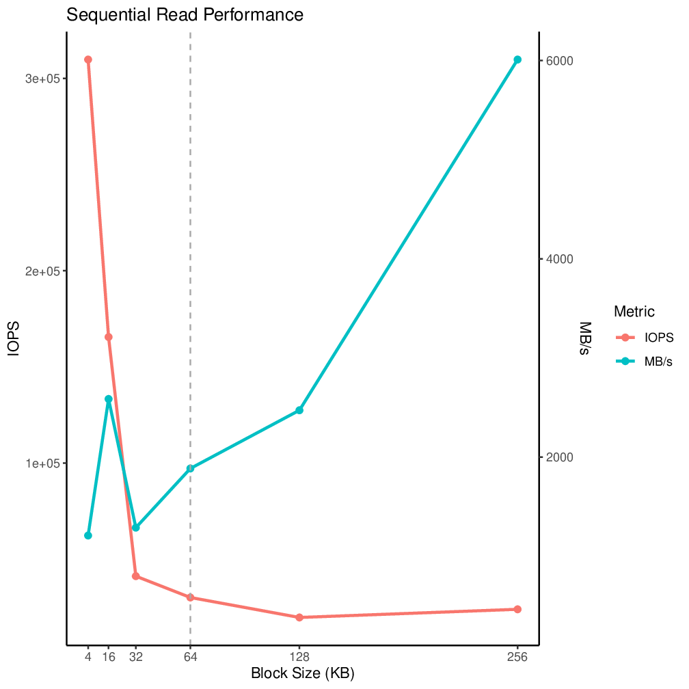
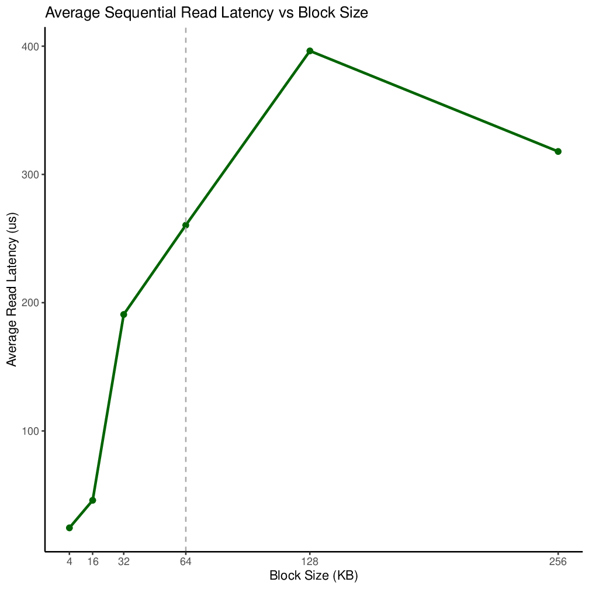
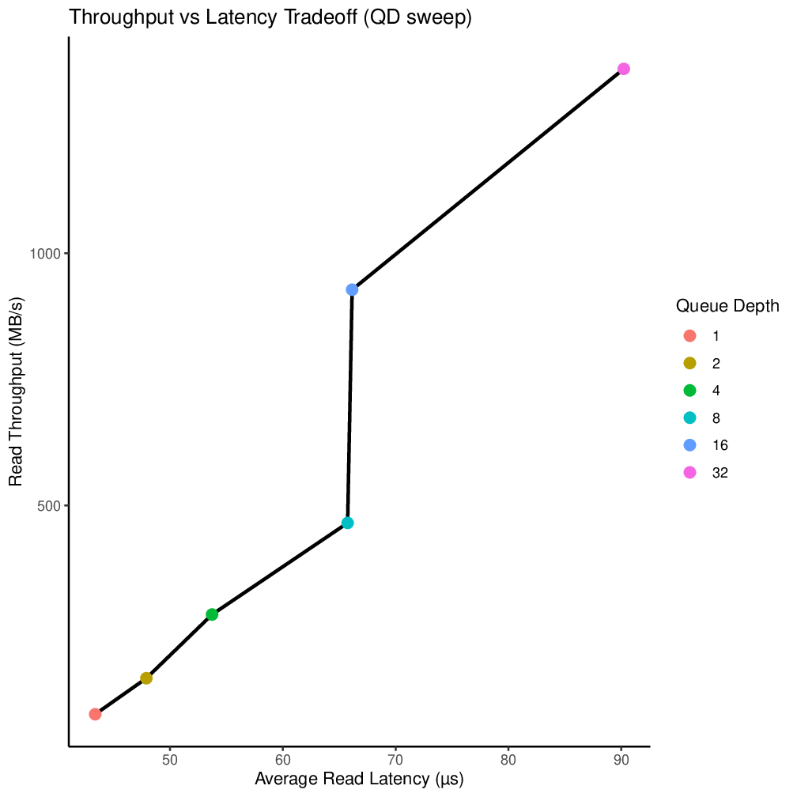

# Project 3
## General Info
I created a new partition on my SSD (located at `/dev/nvme0n1p2`, size 2.86
GiB). On it I put a new ext4 filesystem, although that was immediately lost the
moment I started doing random writes to the partition, so I'm not going to go
into depth on it here.

Other computer/NVMe info can be found in the README at the root of this
repository.

## Usage
All `.fio` files run with
```
sudo fio --output-format=terse,normal [FILE_NAME].fio > [FILE_NAME]_result.txt
```
to generate reports. The can be turned into CSV files for graphing with the
`generate-csvs.sh` program. Tables can be made from the CSV files with
`generate-tables.sh`, and charts with `generate-charts.sh`. To turn the charts
into images,
```
cpdf Rplots.pdf -gs gs -output-image -o images/chart%%.png
```
can be used.

## 1) Zero-Queue Baselines
|  Workload   | Read Avg (us) | Read P95 (us) | Read P99 (us) | Write Avg (us) | Write P95 (us) | Write P99 (us) |
|:-----------:|:-------------:|:-------------:|:-------------:|:--------------:|:--------------:|:--------------:|
| Rand RW 4k  |   59.512150   |      84       |      138      |    8.748372    |       10       |       13       |
| Seq RW 128k |   45.486553   |      59       |      127      |    33.161176   |       33       |       82       |

This is operating on a raw, actual partition, not a file, so we don't need to
worry about the OS cacheing anything or anything like that. Additionally, all
the partitions on my drive are aligned to a MiB boundary.

## 2) Block-Size Sweep


*<center>Figs 1 and 2: IOPS and MB/s measured against block sizes (ranging from
4 KiB to 256 KiB) for both random and sequential reads. Tested with a qd of
8.</center>*

At smaller block sizes, there's a lot more overhead as it needs to make many
requests to read/write to a region of data. As such, we see a high IOPS
measurement but a low amount of actual throughput (MB/s). However, as the blocks
get bigger, it makes more sense to talk about MB/s, as the bottleneck of the
data fetching has moved, and we care more about the internal speed of the SSD
than we do how many requests we're making to it.



*<center>Figs 3 and 4: Average latency measured against block sizes (ranging
from 4 KiB to 256 KiB) for both random and sequential reads. Tested with a qd of
8.</center>*

The larger block size does come with a cost, however. If we're only asking for 4
KiB of data, the NVMe drive can get it back to us relatively quickly. However if
we ask for a larger chunk of data, we have to wait longer for it to fetch all
the data, hence the higher latency. If the goal is to get some small bit of data
quickly, a small block-size makes more sense, but in the long run, when trying
to fetch larger amounts of data, it's more efficient to use larger blocks.

## 3) Read/Write Mix

*<center>Fig 5: Read/write ratio vs performance, measured in IOPS (left axis)
and MB/s (right axis). Tests run on 4k blocks with random reads/writes and a qd
of 16.</center>*


*<center>Fig 6: Read/write ratio vs read/write latency. Tests run on 4k blocks
with random reads/writes and a qd of 16.</center>*

Due to the buffer in the NVMe, we'll see the read latency really suffer on high
write-percentage tests as the buffer has to keep flushing and changing as we
write.Just compare the 30% read to the 100% read.

## 4) Queue-Depth Sweep

*<center>Fig 7: Throughput vs Latency as graphed by sweeping the QD from 1 to
32. Tests run on 4k blocks with random reads.</center>*

The knee is the point where we hit saturation and latency begins to climb
faster, as opposed to linearly as it did before (Little's Law). From this chart,
I would put the knee at a qd of 8, as that's where we see the latency begin to
take off (chart gets really steep). Increasing the qd passed this point you'll
start seeing diminishing returns in throughput, while latency continues to
climb.

## 5) Tail-Latency Characterization
|  Workload   | Read Avg (us) | Read P50 (us) | Read P95 (us) | Read P99 (us) | Read P99.9 (us) |
|:-----------:|:-------------:|:-------------:|:-------------:|:-------------:|:---------------:|
|   qd of 8   |   65.419877   |      60       |      107      |      138      |       191       |
|   qd of 64  |   152.623251  |      134      |      313      |      423      |       593       |
