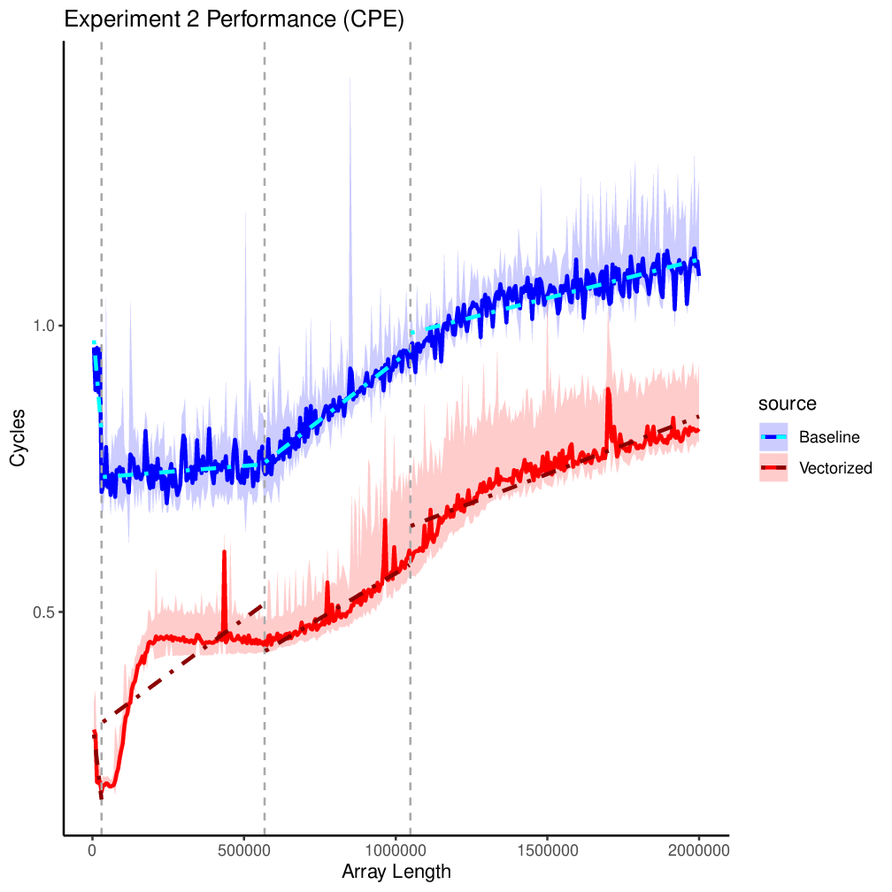

# Project 1
## General Info
Computer/CPU info can be found in the README at the root of this repository

## Usage
The default `make` target will create a baseline and vectorized build of each
source file, as well as assembly outputs (in `src/asm-*/`) and vectorization
reports (in `src/obj-*/` with the `.o` files). `make clean` can be run to delete
all intermediate and output files generated by `make`.

The `generate-csvs.sh` script will run all of the compiled programs and make
CSV files with the relevant data from each experiment. From there,
`generate-charts.R` will create a pdf called `Rplots.pdf` containing graphs of
the CSV data.

To turn the PDF into a series of images I could embed in this markdown file, I
ran:
```
cpdf Rplots.pdf -gs gs -output-image -o images/chart%%.png
```
Of course, the ability to run some of these commands on your machine depends on
having the proper packages installed on your system, namely the 'R' language
(and some R libraries) and 'cpdf'/'gs' for pdf->png conversion.

## 1) 3-Kernel Baseline vs Auto-Vectorization

*<center>Fig 1: FMA Streaming Performance with and without auto-vectorization by
cache locality. Average of 10 runs is shown by the bar height, with the min and
max from the run displayed with the black error bars.</center>*

From this first test, there are a few things worth noting. First, as would be
expected, the tests take longer and more CPU cycles the larger the input array
(fitting into L1 vs L2, etc.). The largest jump is from L3 to DRAM, which
doesn't surprise me in the slightest, as that's when we have to leave the CPU to
fetch data and has the most overhead. And secondly, for each array size, is that
the vectorized implementation takes less time and fewer cycles.

|                    |   L1   |   L2   |  L3   | DRAM  |
|:------------------:|:------:|:------:|:-----:|:-----:|
|      Speedup       |  2.38  |  1.64  | 1.53  | 1.25  |
|  GFLOP/s Baseline  | 7.488  | 6.684  | 5.302 | 4.277 |
| GLOPS/s Vectorized | 17.832 | 10.980 | 8.132 | 5.356 |

---


*<center>Fig 2: Reduction Performance with and without auto-vectorization by
cache locality. Average of 10 runs is shown by the bar height, with the min and
max from the run displayed with the black error bars.</center>*

This second test gives back some very interesting results. I can confirm through
the assembly/vectorization report that this code does get vectorized (proof
later), although we don't see nearly as big of a difference between baseline and
vectorized as we do with FMA Streaming, only a minor benefit in cycles, but
seemingly hardly any in time. I think what's more interesting his how consistent
it is between array sizes. These are the same arrays as the other Experiment 1
tests, yet in those we see a clear pattern where things lake longer as the array
gets larger, but not here.

|                    |    L1    |    L2     |     L3     |    DRAM    |
|:------------------:|:--------:|:---------:|:----------:|:----------:|
|      Speedup       |   1.03   |   1.01    |    1.08    |    1.03    |
|  GFLOP/s Baseline  | 2010.050 | 47169.811 | 95238.095  | 502512.563 |
| GLOPS/s Vectorized | 2072.539 | 47619.048 | 103092.784 | 518134.715 |

---


*<center>Fig 3: Element Multiply Performance with and without auto-vectorization
by cache locality. Average of 10 runs is shown by the bar height, with the min
and max from the run displayed with the black error bars.</center>*

And here is perhaps the weirdest result of all. The L2 Baseline test takes
(relatively) so long that most of the other bars become illegible. Looking at
the raw CSV data, every vectorized run takes ~19 ns and ~13 cycles, regardless
of length. The vectorization it's doing must be really good at compensating for
length, although how we don't see more a difference due to cacheing I couldn't
say. With the baseline tests, the odd thing is of course the L2 test. I have no
idea what's causing it to be such an outlier, but I can say that it's
consistent, not a weird quirk that happened to show itself in this run. Any time
I run the Experiment 1 Baseline program, I get the same spike on L2. My best
guess is that it's either the perfectly wrong size by chance to cause some
caching/tail nonsense in the context of other data present in memory at that
time, or it lost the lottery with where it happened to be put in the program's
memory by the compiler.

|                    |   L1     |    L2     |    L3     |    DRAM    |
|:------------------:|:--------:|:---------:|:---------:|:----------:|
|      Speedup       |   258    |   8361    |   1.09    |    1.07    |
|  GFLOP/s Baseline  |  3.896   |   3.051   | 46511.628 | 235849.057 |
| GLOPS/s Vectorized | 1005.025 | 25510.204 | 50761.421 | 252525.253 |

## 2) Locality Sweep

*<center>Fig 4: Locality Sweep Performance with and without auto-vectorization
by array length, measured in nanoseconds. For each datapoint along the x-axis,
10 measurements were take. The average is plotted as the solid line, with the
mins/maxes bounding the lighter colored envelope. The vertical lines show where
cache locality switches from L1 to L2, L3, and finally DRAM. Additionally, the
line of best fit is plotted (separately per locality section) as shown by the
dotted line. This data was collected using Kernel 1.</center>*


*<center>Fig 5: Locality Sweep Performance with and without auto-vectorization
by array length, measured CPE. The same data collection methodology and plotting
decisions were used as described for Fig 4.</center>*

Looking at *Fig 5*, for the duration of that initial dip in the red line, the
gap between the lines (the SIMD benefits) is relatively large. However, once it
comes to level out more (after the sharp in the L2 section), the red and blue
lines track pretty closely with a consistent offset. I would say that that sharp
rise in L2 (around what appears to be an array length of ~125,000) is where it
switches to memory bound.

Additionally, I do find it interesting how you can see a visible change in slope
in both charts as it hits each locality boundary.

## 3) Alignment and Tail

*<center>Fig 6: Alignment and Tail Performance with and without
auto-vectorization. Average of 10 runs is shown by the bar height, with the min
and max from the run displayed with the black error bars. This data was
collected using Kernel 1.</center>*

My CPU has a vector width of 256 bits, or 32 bytes, or 8 float32s. For this
experiment, the "no-tail" arrays had a length that's a multiple 8, whereas the
"tail" arrays did not. Additionally, the "aligned" arrays were aligned to
32-byte boundaries, and the "misaligned" arrays were offset by 1-byte from this
boundary.

I find it very surprising that "Aligned No-Tail Vectorized" performed the worst.
It has everything going for it, so I would have assumed that it'd do the best,
but alas not. My best guess is that the compiler tried to do some fancy
optimization to it since it's the most ideal, but that whatever it tried only
made things worse. The rest of the data follows mostly as I'd expect, with the
vectorized version having slight improvements over their baseline counterparts.
The alignment/tail seems to have had little effect on the other tests.

## 4) Stride

*<center>Fig 7: Stride Performance with and without auto-vectorization. Average
of 10 runs is shown by the bar height, with the min and max from the run
displayed with the black error bars. This data was collected using Kernel
1.</center>*

I find the results of this test most fascinating. On the basic Stride 1 test, we
see the same vectorization results as we've seen in other tests (notably
Experiment 1). However, as we move away from unit stride, the vectorized results
actually get worse compared to baseline! The difference between the two grows as
the stride gets longer, eventually breaking at the stride of 50. I'm guessing at
such a large stride, the fact that it's skipping a good chunk of the array comes
into play and we get a shorter time. It doesn't look like it's even vectorized
it at 50. At that distance between the elements it may not be able to vectorize
it at all.

I went ahead and tried random stride for the hell of it, with it jumping between
1 and 5 digits randomly for each step through the array. I'm in no way surprised
that it took so long (especially as there's a call to get a random number every
time it steps), but it is noteworthy that vectorization starts having a benefit
again.

## 5) Data Type Comparison

*<center>Fig 8: Data Type Performance with and without auto-vectorization.
Average of 10 runs is shown by the bar height, with the min and max from the run
displayed with the black error bars. This data was collected using Kernel
1.</center>*

The arrays here were the same length despite the differences in data type size,
this means there was twice as many bytes in the float64 arrays. Despite that,
and only being able to fit half as many elements in the vectorization array at a
time, the float64 variant outperformed the float32 variant in both the baseline
and vectorized tests. My best theory is that because this is a 64bit
architecture, the CPU doesn't have to do any sort of masking on the data when
moving it to/from the FPU registers, and can make use of newer instructions that
don't play as well with the older float32.

## 6) Proof of Vectorization
Looking at the disassembly of the vectorized build of Experiment 1, we can find
the code for Kernel 1 (streamed FMA), and we can see right here as it does
multiply/accumulate in a single instruction, operating on 8 floats at a time
(SIMD with a 256 bit vector width).
```asm
.L102:
# include/experiment-utils.h:88:         output[i] = scalar * arr1[i] + arr2[i];
	vmovaps	(%r15,%rax), %ymm0	# MEM <vector(8) float> [(float *)&f32_l2_arr1 + ivtmp.1232_2094 * 1], vect__460.900
	vfmadd213ps	(%r14,%rax), %ymm1, %ymm0	# MEM <vector(8) float> [(float *)&f32_l2_arr2 + ivtmp.1232_2094 * 1], vect_cst__2230, vect__460.900
# include/experiment-utils.h:88:         output[i] = scalar * arr1[i] + arr2[i];
	vmovaps	%ymm0, (%rbx,%rax)	# vect__460.900, MEM <vector(8) float> [(float *)&f32_l2_out + ivtmp.1232_2094 * 1]
	addq	$32, %rax	#, ivtmp.1232
	cmpq	$2000000, %rax	#, ivtmp.1232
	jne	.L102	#,

```
If we look at the vectorization report, we can see a number of lines such as:
```
include/experiment-utils.h:116:26: optimized: loop vectorized using 32 byte vectors
```
That confirm that vectorization exists in the other kernels as well. (In this
example, line 116 of `experiment-utils.h` corresponds to the `for` loop of
`element_multiply()`.)

## 7) Roofline
Kernel 1 has a FLOPs/byte of 1/6. If we take the GFLOP/s number from earlier
(17.832, achieved with vectorized L1-sized arrays)
