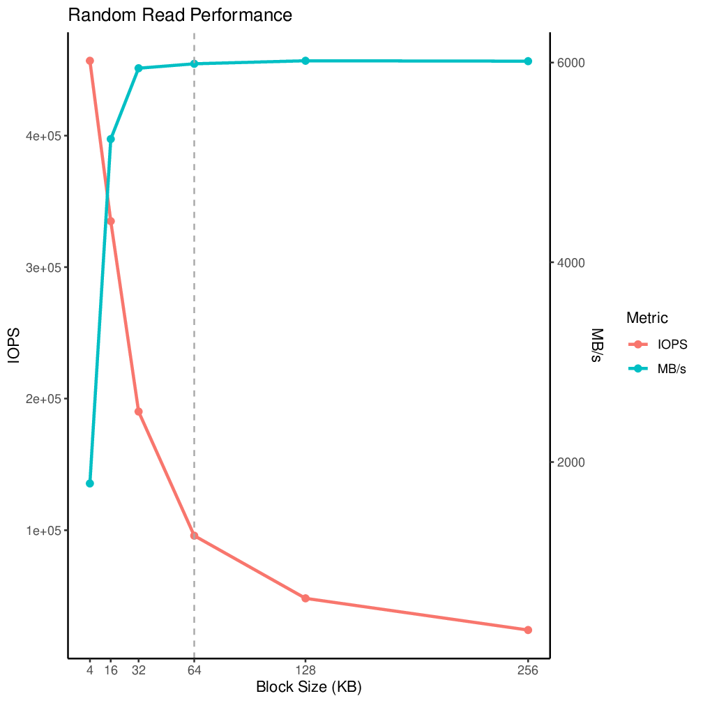

# Project 3
## General Info
I created a new partition on my SSD (located at `/dev/nvme0n1p2`, size 2.86
GiB). On it I put a new ext4 filesystem, although that was immediately lost the
moment I started doing random writes to the partition, so I'm not going to go
into depth on it here.

Other computer/NVMe info can be found in the README at the root of this
repository.

## Usage
All `.fio` files run with
```
sudo fio --output-format=terse,normal [FILE_NAME].fio > [FILE_NAME]_result.txt
```
to generate reports. The can be turned into CSV files for graphing with the
`generate-csvs.sh` program. Tables can be made from the CSV files with
`generate-tables.sh`, and charts with `generate-charts.sh`. To turn the charts
into images,
```
cpdf Rplots.pdf -gs gs -output-image -o images/chart%%.png
```
can be used.

## 1) Zero-Queue Baselines
|  Workload   | Read Avg (us) | Read P95 (us) | Read P99 (us) | Write Avg (us) | Write P95 (us) | Write P99 (us) |
|:-----------:|:-------------:|:-------------:|:-------------:|:--------------:|:--------------:|:--------------:|
| Rand RW 4k  |   59.512150   |      84       |      138      |    8.748372    |       10       |       13       |
| Seq RW 128k |   45.486553   |      59       |      127      |    33.161176   |       33       |       82       |

## 2) Block-Size Sweep

*<center>Fig 1: </center>*
